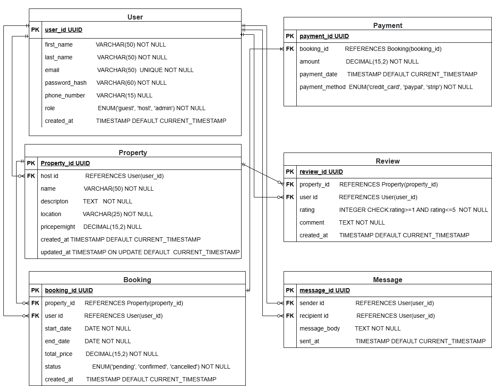

## Entity-Relationship Diagram (ERD)

**Definition:**
An Entity-Relationship Diagram (ERD) is a visual representation of the entities (tables) in a database and the relationships between them. ERDs help to conceptualize how data is structured and how entities interact within the system.

### Components:

- **Entities**: Real-world objects represented as tables (e.g., `User`, `Booking`, `Payment`)
- **Attributes**: Fields that describe the properties of entities (e.g., `user_id`, `email`, `pricepernight`)
- **Relationships**: Logical connections between entities (e.g., a `User` makes a `Booking`, a `Booking` includes a `Payment`)

---

## Database Schema Overview

### User

| Field           | Type         | Constraints               | Description                 |
|----------------|--------------|---------------------------|-----------------------------|
| `user_id`       | UUID         | Primary Key, NOT NULL     | Unique user identifier      |
| `first_name`    | VARCHAR(50)  | NOT NULL                  | User’s first name           |
| `last_name`     | VARCHAR(50)  | NOT NULL                  | User’s last name            |
| `email`         | VARCHAR(100) | NOT NULL, UNIQUE, Indexed | User’s email address        |
| `password_hash` | VARCHAR(60)  | NOT NULL                  | Encrypted user password     |
| `phone_number`  | VARCHAR(15)  | NULLABLE                  | Optional contact number     |
| `role`          | ENUM         | NOT NULL                  | guest, host, or admin       |
| `created_at`    | TIMESTAMP    | DEFAULT CURRENT_TIMESTAMP | Account creation timestamp  |

---

### Property

| Field           | Type          | Constraints                 | Description                    |
|----------------|---------------|-----------------------------|--------------------------------|
| `property_id`   | UUID          | Primary Key, NOT NULL       | Unique property identifier     |
| `host_id`       | UUID (FK)     | NOT NULL                    | References `User(user_id)`     |
| `name`          | VARCHAR(50)   | NOT NULL                    | Property name                  |
| `description`   | TEXT          | NOT NULL                    | Description of the property    |
| `location`      | VARCHAR(50)   | NOT NULL                    | Geographical location          |
| `pricepernight` | DECIMAL(10,2) | NOT NULL                    | Cost per night                 |
| `created_at`    | TIMESTAMP     | DEFAULT CURRENT_TIMESTAMP   | Creation timestamp             |
| `updated_at`    | TIMESTAMP     | ON UPDATE CURRENT_TIMESTAMP | Last modification timestamp    |

---

### Booking

| Field         | Type          | Constraints               | Description                          |
|---------------|---------------|---------------------------|--------------------------------------|
| `booking_id`  | UUID          | Primary Key, NOT NULL     | Unique booking identifier            |
| `property_id` | UUID (FK)     | NOT NULL                  | References `Property(property_id)`   |
| `user_id`     | UUID (FK)     | NOT NULL                  | References `User(user_id)`           |
| `start_date`  | DATE          | NOT NULL                  | Check-in date                        |
| `end_date`    | DATE          | NOT NULL                  | Check-out date                       |
| `total_price` | DECIMAL(10,2) | NOT NULL                  | Total booking cost                   |
| `status`      | ENUM          | NOT NULL                  | pending, confirmed, or canceled      |
| `created_at`  | TIMESTAMP     | DEFAULT CURRENT_TIMESTAMP | Time of booking creation             |

---

### Payment

| Field            | Type          | Constraints               | Description                          |
|------------------|---------------|---------------------------|--------------------------------------|
| `payment_id`     | UUID          | Primary Key, NOT NULL     | Unique payment identifier            |
| `booking_id`     | UUID (FK)     | NOT NULL                  | References `Booking(booking_id)`     |
| `amount`         | DECIMAL(10,2) | NOT NULL                  | Amount paid                          |
| `payment_date`   | TIMESTAMP     | DEFAULT CURRENT_TIMESTAMP | Payment date and time                |
| `payment_method` | ENUM          | NOT NULL                  | credit_card, paypal, or stripe       |

---

### Review

| Field         | Type      | Constraints                          | Description                          |
|---------------|-----------|--------------------------------------|--------------------------------------|
| `review_id`   | UUID      | Primary Key, NOT NULL                | Unique review identifier             |
| `property_id` | UUID (FK) | NOT NULL                             | References `Property(property_id)`   |
| `user_id`     | UUID (FK) | NOT NULL                             | References `User(user_id)`           |
| `rating`      | INTEGER   | NOT NULL, CHECK BETWEEN 1 AND 5      | Star rating for the property         |
| `comment`     | TEXT      | NOT NULL                             | User’s feedback                      |
| `created_at`  | TIMESTAMP | DEFAULT CURRENT_TIMESTAMP            | Review submission timestamp          |

---

### Message

| Field          | Type      | Constraints               | Description                         |
|----------------|-----------|---------------------------|-------------------------------------|
| `message_id`   | UUID      | Primary Key, NOT NULL     | Unique message identifier           |
| `sender_id`    | UUID (FK) | NOT NULL                  | References `User(user_id)` (sender) |
| `recipient_id` | UUID (FK) | NOT NULL                  | References `User(user_id)` (receiver) |
| `message_body` | TEXT      | NOT NULL                  | Text content of the message         |
| `sent_at`      | TIMESTAMP | DEFAULT CURRENT_TIMESTAMP | Message sent timestamp              |

---
